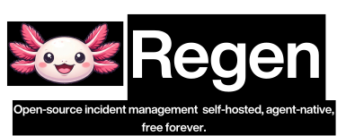

<p align="center">
  <picture>
    <source media="(prefers-color-scheme: light)" srcset=".github/assets/logo-light.svg">
    
  </picture>
</p>

<p align="center">
  Part of the <a href="https://fluidify.ai">Fluidify</a> open-source suite
</p>

<p align="center">
  <a href="https://github.com/FluidifyAI/Regen/actions/workflows/ci.yml"></a>
  <a href="https://github.com/FluidifyAI/Regen/releases"></a>
  <a href="https://discord.gg/b6PSdhzDa"></a>
  <a href="LICENSE"></a>
  <a href="https://github.com/FluidifyAI/Regen/pkgs/container/regen"></a>
  <a href="https://goreportcard.com/report/github.com/FluidifyAI/Regen"></a>
</p>

---

> **Grafana OnCall was archived in March 2026.** ~50,000 teams are looking for a self-hosted alternative.
> PagerDuty costs $50/user/month — **$120,000/year** for a 200-person team. Fluidify Regen is free, forever.

---

## Install

Three ways to run — pick what fits your stack:

### Docker (fastest)

```bash
docker pull ghcr.io/fluidifyai/regen:latest
```

Need the full stack? One command:

```bash
curl -O https://raw.githubusercontent.com/FluidifyAI/Regen/main/docker-compose.yml
docker-compose up -d
```

Open **http://localhost:8080** — API and UI are ready. No configuration required to start receiving alerts.

### Docker Compose (recommended for self-hosting)

```bash
git clone https://github.com/FluidifyAI/Regen.git
cd Regen
cp .env.example .env   # edit as needed
docker-compose up -d
```

### Kubernetes (Helm)

```bash
helm install fluidify-regen deploy/helm/fluidify-regen \
  --set ingress.host=incidents.your-domain.com \
  --set postgresql.auth.password=<strong-password>
```

For production HA (external DB, Redis Sentinel, zero-downtime deploys), see [docs/OPERATIONS.md](docs/OPERATIONS.md).

## Built for production

Fluidify Regen is designed to run as reliably as the tools it monitors.

- **Zero-downtime deploys** — rolling restarts drain in-flight requests before pod shutdown (SIGTERM → 30 s drain → exit)
- **PostgreSQL HA** — streaming replication with PgBouncer; connection pool survives primary failover
- **Redis Sentinel** — 3-node quorum watches primary; workers reconnect to new master automatically
- **Kubernetes-native** — HPA, health-gated rolling deploys, resource limits out of the box
- **Webhook flood protection** — rate limiter returns 429 before the DB sees load spikes; validated by k6 burst test
- **Full observability** — `/metrics` (Prometheus) + pre-built Grafana dashboard in `deploy/grafana/`

Reproduce the benchmarks yourself: `make load-test` and `make chaos-db`.

### Send a test alert

```bash
curl -X POST http://localhost:8080/api/v1/webhooks/prometheus \
  -H "Content-Type: application/json" \
  -d '{
    "receiver": "fluidify-regen",
    "status": "firing",
    "alerts": [{
      "status": "firing",
      "labels": {"alertname": "TestAlert", "severity": "critical"},
      "annotations": {"summary": "Test alert from curl"},
      "startsAt": "2024-01-01T00:00:00Z"
    }]
  }'
```

An incident is created automatically. If Slack is configured, a dedicated channel appears within seconds.

---

## Coming from Grafana OnCall?

Grafana OnCall was archived in March 2026. Fluidify Regen is built to be the drop-in OSS successor — same self-hosted model, no SaaS lock-in.

Point your Alertmanager at Regen and you're receiving alerts in minutes:

```yaml
# alertmanager.yml
receivers:
  - name: fluidify-regen
    webhook_configs:
      - url: http://your-regen-host:8080/api/v1/webhooks/prometheus
```

**One-click migration from Grafana OnCall** *(coming soon)* — import your on-call schedules, escalation policies, and routing rules with a single CLI command:

```bash
# Coming in v1.1
regen migrate --from grafana-oncall --token <your-grafana-token>
```

> Want to help build this? [See the open issue →](https://github.com/FluidifyAI/Regen/issues)

---

## Features

| | Community (AGPLv3, free) | Enterprise (paid) |
|---|---|---|
| Alert ingestion (Prometheus, Grafana, CloudWatch, generic) | ✅ | ✅ |
| Incident lifecycle with immutable timeline | ✅ | ✅ |
| On-call rotations, layers, overrides | ✅ | ✅ |
| Escalation policies | ✅ | ✅ |
| Slack integration (channels, bot commands, timeline sync) | ✅ | ✅ |
| Microsoft Teams integration (Adaptive Cards, bot commands) | ✅ | ✅ |
| AI incident summaries + post-mortem drafts (BYO OpenAI key) | ✅ | ✅ |
| SSO / SAML (Okta, Azure AD, Google Workspace) | ✅ | ✅ |
| Docker Compose + Kubernetes Helm chart | ✅ | ✅ |
| SCIM user provisioning | ❌ | ✅ |
| Audit log export (SOC2-ready) | ❌ | ✅ |
| Role-based access control (RBAC) | ❌ | ✅ |
| Retention policies | ❌ | ✅ |
| Priority support + SLA | ❌ | ✅ |

> SSO is free. Gating SSO behind a paid tier is user-hostile. We stay off [sso.tax](https://sso.tax).

### What we're building next

We're working toward fully autonomous incident response — AI agents that triage, correlate, and resolve before your on-call engineer's phone rings. Interested? **[Join the discussion →](https://github.com/FluidifyAI/Regen/discussions)** or **[pick up an open issue →](https://github.com/FluidifyAI/Regen/issues?q=is%3Aissue+is%3Aopen+label%3A%22help+wanted%22)**

---

## AI Agents

Fluidify ships with AI agents that work autonomously during and after incidents. Your OpenAI key, your infrastructure — incident data never leaves your stack.

### Incident Summarization

Reads the full incident timeline and linked Slack thread, then writes a concise summary of what happened, what was done, and current status. Useful for commanders joining mid-incident or shift handoffs.

```bash
curl -X POST http://localhost:8080/api/v1/incidents/INC-042/summarize \
  -H "Authorization: Bearer YOUR_TOKEN"
```

### Historical Pattern Matching

When an incident fires, Regen searches your full incident history for similar patterns — same service, same alert fingerprint, similar timeline signatures — and surfaces the match directly in Slack:

> 🤖 **Regen:** This looks like INC-157 from November (Redis memory eviction, resolved in 18 min). [View timeline →]

Engineers stop re-diagnosing problems they've already solved. Every incident makes the next one faster.

### Post-Mortem Agent

Generates a structured post-mortem draft from the incident timeline, status changes, and linked alerts. Extracts contributing factors and action items automatically. Supports custom templates.

```bash
curl -X POST http://localhost:8080/api/v1/incidents/INC-042/postmortem/generate \
  -H "Authorization: Bearer YOUR_TOKEN"
```

### Handoff Digest

Generates a shift-handoff briefing covering all open incidents, recent status changes, and pending action items — delivered to Slack or Teams at the start of each shift.

### What's coming — the agent roadmap

| Agent | What it does | Status |
|---|---|---|
| **Triage agent** | Calls Datadog, K8s, GitHub MCP — gathers context before you unlock your phone | 🔨 In progress |
| **Co-pilot mode** | Agent proposes action + confidence score, human approves with one tap | 🔨 In progress |
| **Root cause agent** | Correlates metrics, logs, and recent deploys to surface likely root cause | 📋 Planned |
| **Runbook agent** | Matches incident to known runbooks, executes with human gate | 📋 Planned |
| **Noise reduction** | Learns alert patterns, suppresses known-noisy low-signal alerts | 📋 Planned |

> Want to help build this? The agent scaffolding is open. **[See the roadmap issues →](https://github.com/FluidifyAI/Regen/issues)**

---

## Integrations

### Available now

| Category | Tools |
|---|---|
| 🚨 **Alert ingestion** | Prometheus Alertmanager · Grafana · AWS CloudWatch · Generic webhook |
| 💬 **Chat** | Slack · Microsoft Teams · Telegram |
| 🤖 **AI** | OpenAI GPT-4o / GPT-4 / GPT-3.5 (BYO key) |
| 🔐 **Auth** | SAML 2.0 — Okta · Azure AD · Google Workspace · any compliant IdP |
| 🚀 **Deploy** | Docker Compose · Kubernetes Helm · bare metal |

### Coming soon

| Category | Tools |
|---|---|
| 🚨 **Alert ingestion** | Datadog · New Relic · Sentry · Dynatrace · Elastic · Zabbix · Uptime Kuma · Betterstack |
| 🔁 **Migration / import** | Grafana OnCall · PagerDuty · Opsgenie · Splunk On-Call |
| 📄 **Post-mortem export** | Confluence · Notion · Jira |
| 🤖 **AI providers** | Anthropic Claude · local LLMs via Ollama |
| 💬 **Chat** | Discord |

> Missing something? [Open an issue](https://github.com/FluidifyAI/Regen/issues/new) — the generic webhook covers most tools today.

---

## Comparison

| | Fluidify Regen | PagerDuty | incident.io | Grafana OnCall |
|---|---|---|---|---|
| Price | Free / flat enterprise | ~$21–50/user/mo | ~$30+/user/mo | Archived |
| Self-hosted | ✅ | ❌ | ❌ | ✅ (archived) |
| Open source | AGPLv3 | ❌ | ❌ | Apache 2.0 |
| SSO | ✅ Free | 💰 Paid tier | 💰 Paid tier | ✅ Free |
| BYO AI | ✅ | ❌ | ❌ | ❌ |
| Agent-native | ✅ | ❌ | ❌ | ❌ |
| Alert + incident + on-call in one | ✅ | ⚠️ | ⚠️ | ⚠️ |

---

## Roadmap

**Shipping next (v1.x)**
- Grafana OnCall one-click migration
- PagerDuty schedule + escalation policy import
- Co-pilot mode — agent proposes, human approves with confidence score
- Fluidify MCP Server — Claude, GPT, and custom bots can call Regen natively
- Confluence / Notion post-mortem export
- RBAC, SCIM, audit log export (Enterprise)

**The bigger picture**

Fluidify Regen is built for the age of AI agents. The vision: before your on-call engineer unlocks their phone, the triage agent has already pulled correlated metrics from Datadog, checked K8s pod health, matched the incident against your history, and posted a one-tap approval request to Slack. The engineer taps Approve. Done.

Every incident makes the system smarter. After 12 months, your triage agent knows your stack better than most of your engineers. That institutional memory lives in your own infrastructure — not in a SaaS vendor's cloud.

| Horizon | Theme |
|---|---|
| **v1.x** | Agent scaffolding — co-pilot mode, MCP server, Datadog/K8s/Linear integrations |
| **v2.x** | Autonomous ops — triage agent, runbook execution, confidence gates |
| **v3.x** | Multi-agent — triage + comms + runbook agents in parallel |
| **Horizon** | Predictive ops — incidents resolved before alerts fire |

[Star the repo](https://github.com/FluidifyAI/Regen) to follow along.

---

## Contributing

Issues, PRs, and feature requests are welcome. If you're coming from Grafana OnCall, your experience building on that platform is exactly what we need.

```bash
# Start backend + dependencies
docker-compose up -d db redis

# Run backend with hot reload
cd backend && go run ./cmd/regen/... serve

# Run frontend with hot reload
cd frontend && npm install && npm run dev
```

See [CONTRIBUTING.md](CONTRIBUTING.md) and [Makefile](Makefile) (`make help`) for all commands. For bigger changes, [open a discussion first](https://github.com/FluidifyAI/Regen/discussions).

---

## License

- **Community**: [AGPLv3](LICENSE) — free forever, including SSO
- **Enterprise**: Proprietary — [enterprise@fluidify.ai](mailto:enterprise@fluidify.ai)

---

<p align="center">Built by <a href="https://fluidify.ai">Fluidify</a> · your incident data belongs to you</p>
