<p align="center">
  <picture>
    <source media="(prefers-color-scheme: light)" srcset=".github/assets/logo-light.svg">
    
  </picture>
</p>

<p align="center">
  Part of the <a href="https://fluidify.ai">FluidifyAI</a> open-source suite
</p>

<p align="center">
  <a href="https://github.com/FluidifyAI/Regen/actions/workflows/ci.yml"></a>
  <a href="https://github.com/FluidifyAI/Regen/releases"></a>
  <a href="https://discord.gg/b6PSdhzDa"></a>
  <a href="LICENSE"></a>
  <a href="https://github.com/FluidifyAI/Regen/pkgs/container/regen"></a>
  <a href="https://goreportcard.com/report/github.com/FluidifyAI/Regen/backend"></a>
</p>

---

> Unlimited alert noise reduction and incidents, unlimited on-call schedules, and unlimited AI postmortems and handoff digests with 1-click Import from Grafana Oncall/Pagerduty
---

## Features

### - Incident lifecycle with immutable timeline
<table>
  <tr>
    <td width="50%">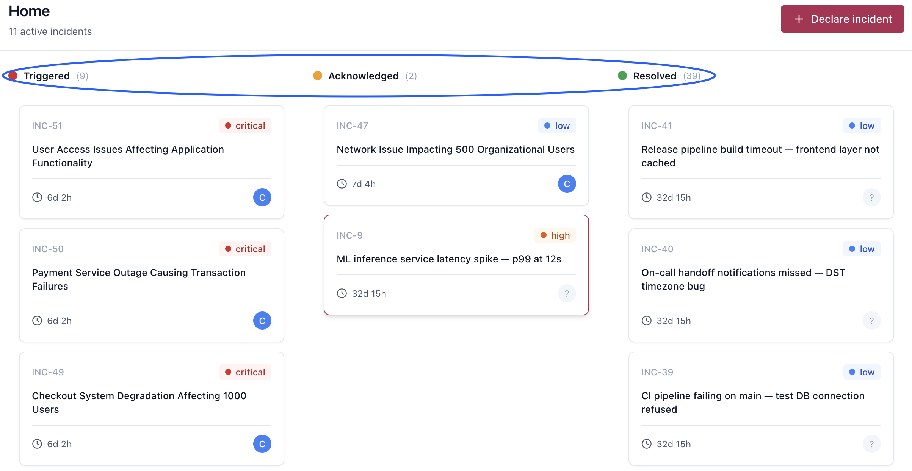</td>
    <td width="50%">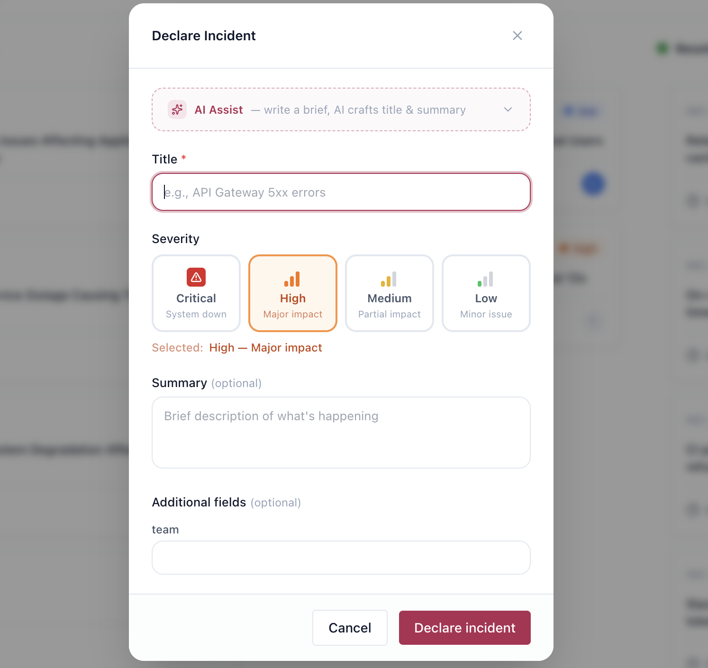</td>
  </tr>
</table>

### - Escalation policies with multi-step timeouts
<table>
  <tr>
    <td width="50%">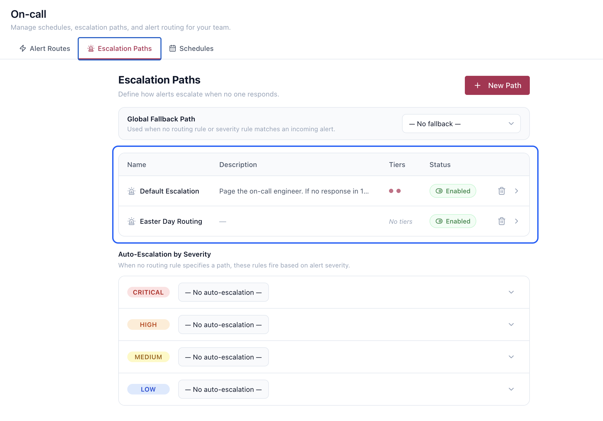</td>
    <td width="50%">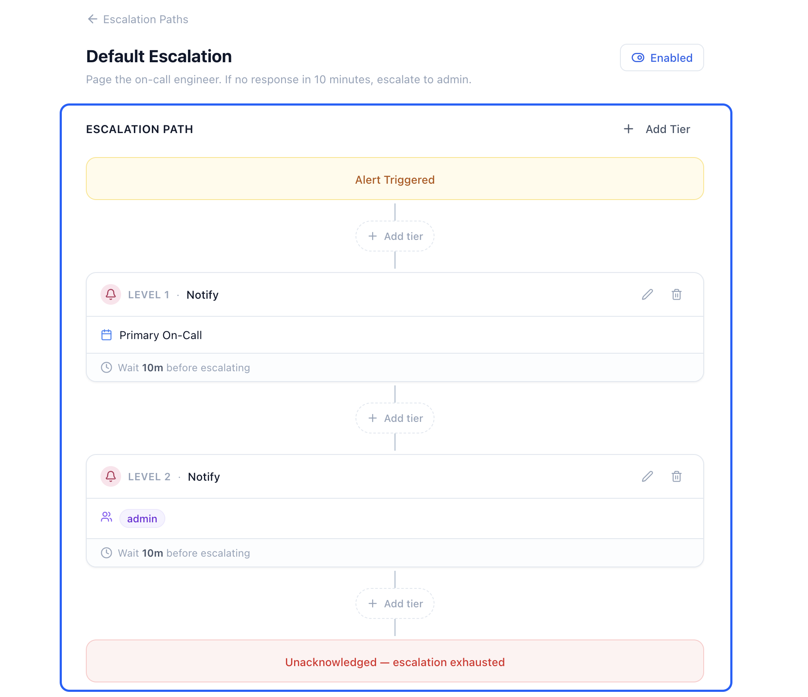</td>
  </tr>
</table>

### - Alert ingestion — Prometheus, Grafana, CloudWatch, generic webhook
<p align="center">
  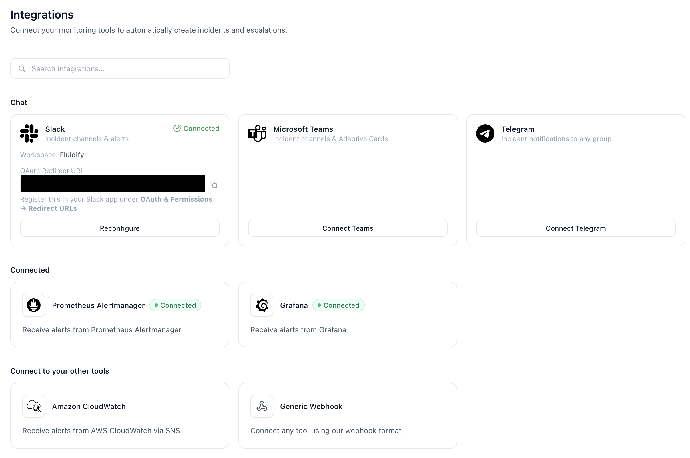
</p>

### - Slack integration — channels, bot commands, timeline sync
### - Microsoft Teams integration — Adaptive Cards, bot commands
### - 1-click migration from Grafana OnCall/PagerDuty
<p align="center">
  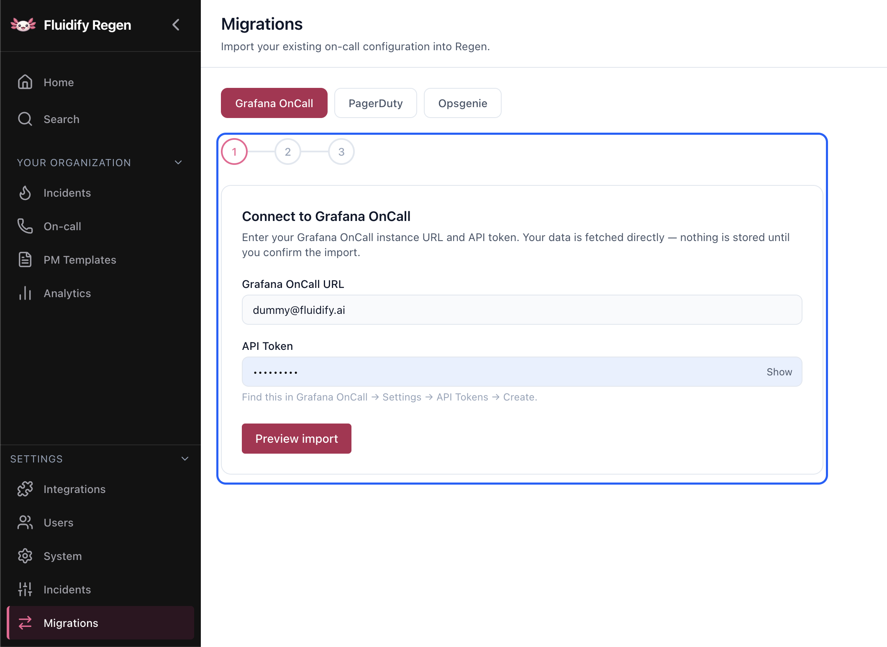
</p>


### - AI incident summaries, Post-mortem, Handoffs Summaries with Slack/Teams synch (BYO key — OpenAI/Anthropic/Ollama)
<table>
  <tr>
    <td width="50%">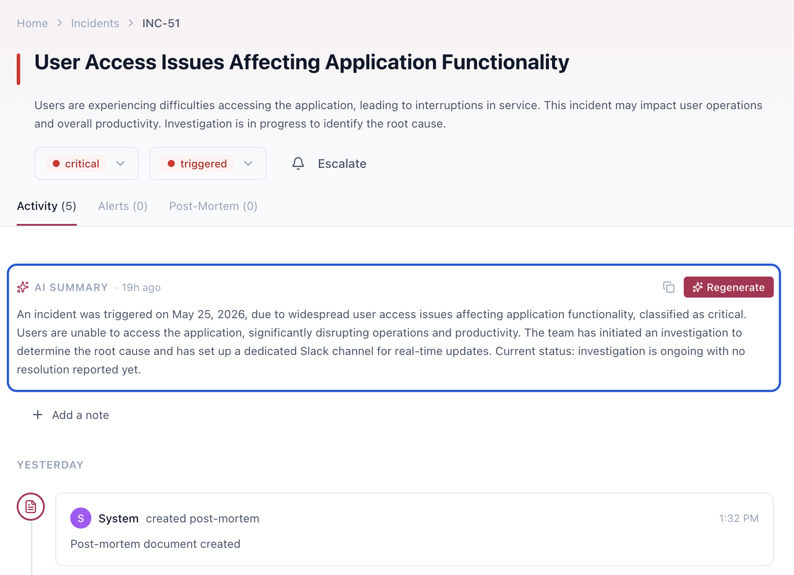</td>
    <td width="50%">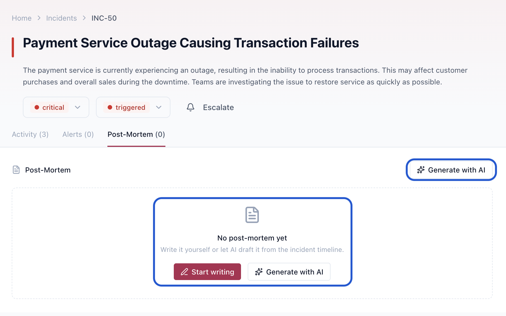</td>
  </tr>
  <tr>
    <td width="50%">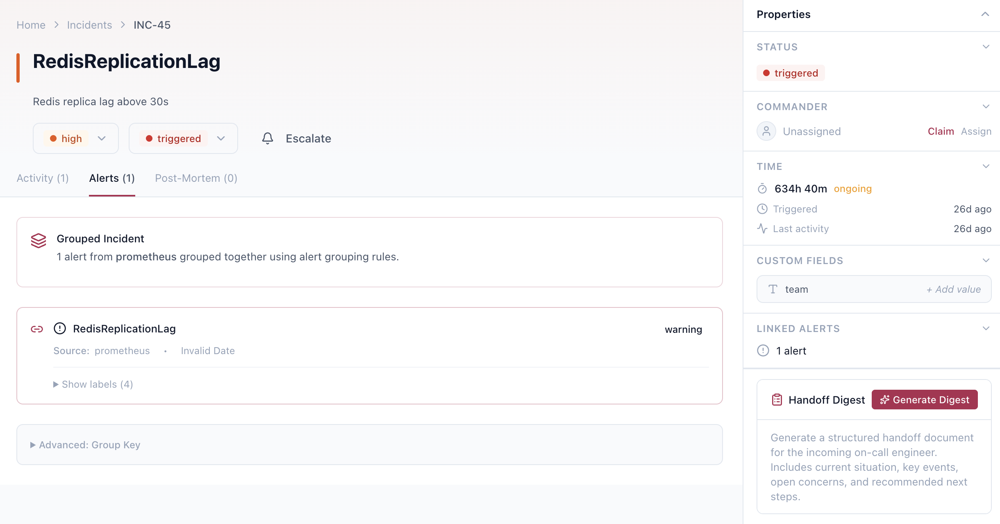</td>
    <td width="50%">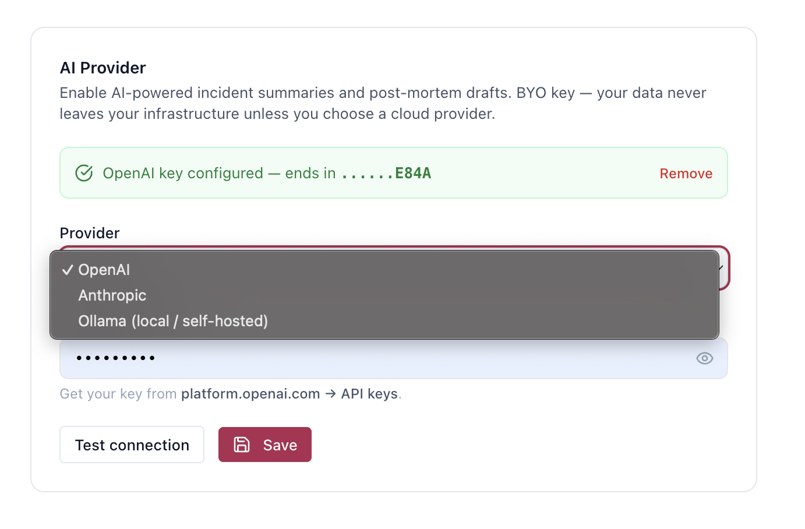</td>
  </tr>
</table>

### - SSO / SAML — Okta, Azure AD, Google Workspace
<p align="center">
  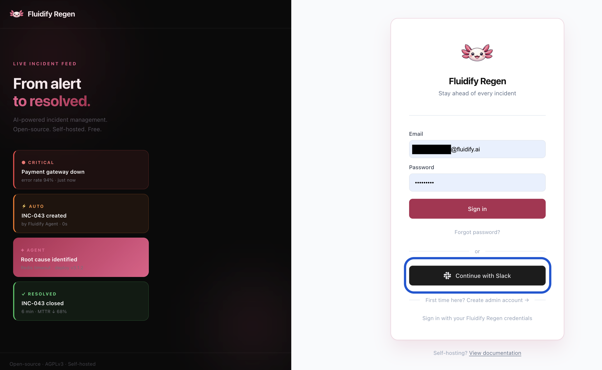
</p>

### - Docker Compose + Kubernetes Helm chart
### - PostgreSQL HA + Redis Sentinel support
### - No limits on incidents/AI features

---

## Integrations

| Category | Tools |
|---|---|
| **Alert ingestion** | Prometheus Alertmanager · Grafana · AWS CloudWatch · Generic webhook |
| **Chat** | Slack · Microsoft Teams · Telegram |
| **AI** | OpenAI · Anthropic · Ollama (BYO key — local or cloud) |
| **Auth** | SAML 2.0 — Okta · Azure AD · Google Workspace · any compliant IdP |
| **Migration** | Grafana OnCall · PagerDuty |
| **Deploy** | Docker Compose · Kubernetes Helm · bare metal |

---

## Fluidify Regen Vs Pagerduty/incident.io/Grafana Oncall

| | Regen | PagerDuty | incident.io | Grafana OnCall |
|---|---|---|---|---|
| Price | Free  | $21–50/user/mo | $30+/user/mo | Archived |
| Self-hosted | ✅ | ❌ | ❌ | ✅ (archived) |
| Open source | AGPLv3 | ❌ | ❌ | Apache 2.0 |
| SSO | ✅ Free | 💰 Paid | 💰 Paid | ✅ Free |
| BYO AI | ✅ | ❌ | ❌ | ❌ |
| Agent-native | ✅ | ❌ | ❌ | ❌ |
| Alert + incident + on-call in one | ✅ | 💰💰💰 Paid | 💰💰💰 Paid | 💰💰💰 Paid |
| 1-Click imports | ✅ | ❌ | ❌ | ❌ |

---

> ## Migrate in 1 click from
>
> - [PagerDuty](docs/migrations/pagerduty.md)
> - [Grafana Oncall](docs/migrations/grafana-oncall.md)

---

## Installation

```bash
docker pull ghcr.io/fluidifyai/regen:latest
```

For detailed installation guides, see:
- [Docker](install-docker.md)
- [Docker Compose](install-docker-compose.md)
- [Kubernetes](install-kubernetes.md)


> Don't wanna host and manage yourself? [Get in touch](https://fluidify.ai/contact) and we'd do it for you.
---

## Built for production

### Benchmark results (HA stack · Apple M2 / Colima · 2026-03-31)

| Scenario | Result |
|---|---|
| Webhook ingestion p99 | **< 10 ms** (target: < 200 ms) |
| Webhook sustained p50 / p95 | **1.55 ms / 2.82 ms** |
| API reads p95 (list / detail) | **4.42 ms / 2.83 ms** |
| Peak throughput (burst test) | **3,917 RPS — 0 × 5xx** |
| PostgreSQL failover RTO | **11 s** (Patroni + HAProxy, target: < 60 s) |
| Redis failover RTO | **5 s** (Sentinel 3-node quorum) |
| In-flight requests lost on rolling deploy | **0** |

> Production numbers will be higher — these were captured on a single-machine local HA stack.
> Reproduce yourself: `make load-test` and `make chaos-db`. Full methodology in [docs/RELIABILITY.md](docs/RELIABILITY.md).

### How it stays up

- **Zero-downtime deploys** — rolling restarts drain in-flight requests before pod shutdown (SIGTERM → 30 s drain → exit)
- **PostgreSQL HA** — Patroni manages automatic primary election; HAProxy re-routes to the new primary within one health-check interval (3 s). No app restart, no config change.
- **Redis Sentinel** — 3-node quorum detects primary loss; workers reconnect to new master automatically
- **Kubernetes-native** — HPA, health-gated rolling deploys, resource limits out of the box
- **Webhook flood protection** — rate limiter returns 429 before the DB sees load spikes; validated at 3,917 RPS with zero OOM events
- **Full observability** — `/metrics` (Prometheus) + pre-built Grafana dashboard in `deploy/grafana/`

### Send a test alert

```bash
curl -X POST http://localhost:8080/api/v1/webhooks/prometheus \
  -H "Content-Type: application/json" \
  -d '{
    "receiver": "fluidify-regen",
    "status": "firing",
    "alerts": [{
      "status": "firing",
      "labels": {"alertname": "TestAlert", "severity": "critical"},
      "annotations": {"summary": "Test alert from curl"},
      "startsAt": "2024-01-01T00:00:00Z"
    }]
  }'
```

An incident is created automatically. If Slack is configured, a dedicated channel appears within seconds.

> **Connecting Slack:** Regen uses Slack's HTTP Events API (signed `POST` to `/api/v1/slack/{events,interactions,commands}`) — not Socket Mode. Local dev needs a public tunnel (ngrok). Full setup, including the three Request URLs and troubleshooting, is in [docs/getting-started/connecting-slack.md](docs/getting-started/connecting-slack.md).

---

## Security
- **Authentication**: bcrypt (cost 12), timing-safe comparison, 5-attempt account lockout, HTTP-only SameSite=Strict session cookies
- **No SQL injection surface**: All database access uses GORM parameterized queries — no raw string interpolation
- **Webhook verification**: Slack (HMAC-SHA256 + replay protection), Teams (RSA/OIDC), CloudWatch (RSA + SSRF-safe cert validation)
- **Rate limiting**: Redis Lua script enforcing three tiers — 10/min on auth endpoints, 120/min unauthenticated, 600/min authenticated
- **Security headers**: CSP, HSTS (2 years), X-Frame-Options, X-Content-Type-Options, Permissions-Policy on every response
- **Container hardening**: non-root UID 1001, read-only filesystem, all Linux capabilities dropped
- **CORS**: explicit allowlist via `CORS_ALLOWED_ORIGINS`; dev-only fallback to localhost
- **Frontend**: no `dangerouslySetInnerHTML`, no secrets in bundle, session token never accessible to JavaScript

Review the **[Production Security Checklist](SECURITY.md#11-production-security-checklist)** — TLS, PostgreSQL password, Redis auth, and CORS origins for prerequisiste checklist.

Full security architecture: [SECURITY.md](SECURITY.md)

> Don't wanna manage uptime and security? [Get in touch](https://fluidify.ai/contact) and we'd do it for you.

---

## Contributing

We love contributions big and small. This is how you join us:

```bash
# Start backend + dependencies
docker-compose up -d db redis

# Run backend with hot reload
cd backend && go run ./cmd/regen/... serve

# Run frontend with hot reload
cd frontend && npm install && npm run dev
```

Read for raising a PR:
- Read the setup & workflow in [CONTRIBUTING.md](CONTRIBUTING.md)
- Discover all developer commands with `make help`
- Have a big idea? [Let’s discuss it first](https://github.com/FluidifyAI/Regen/discussions)

---

## Support us
If you find Regen useful, consider supporting us by:
- Star this repo - It helps others discover Regen
- [Guide us](https://github.com/FluidifyAI/Regen/issues/new) - Every issue you raise goes into building

---

## License

[AGPLv3](LICENSE) — free forever, including SSO.

---

<p align="center">Built by <a href="https://fluidify.ai">FluidifyAI</a> · your incident data belongs to you</p>
